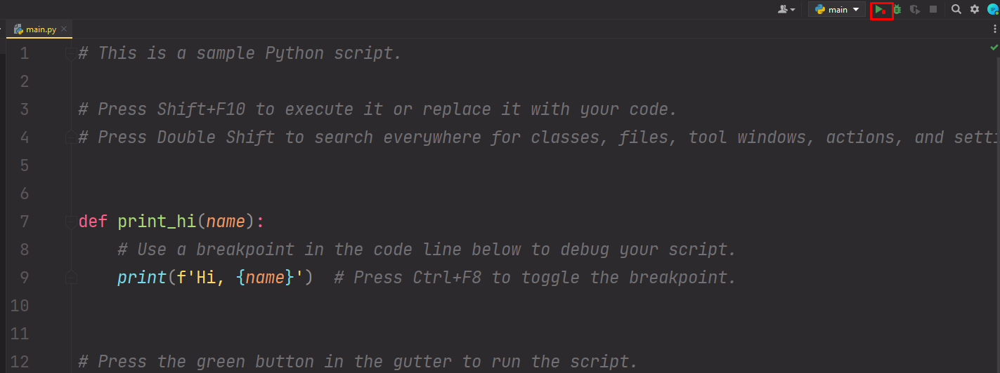

# Установка среды разработки

Мы установили только Python, а сейчас нужно установить программу, где мы будем писать код. Таких есть много, например VS code, Pycharm и т.д. Но мы будем использовать [PyCharm](https://www.jetbrains.com/pycharm/).&#x20;

Устанавливаем PyCharm, нюансов здесь нет. Создаем новый проект в PyCharm:

.png>)

.png>)

У нас создался файл `main.py`

.png>)

Удаляем все из этого файла. В последующих статьях я буду писать код именно в этом файле. Запускать будем файл с помощью кнопки "Запустить":

